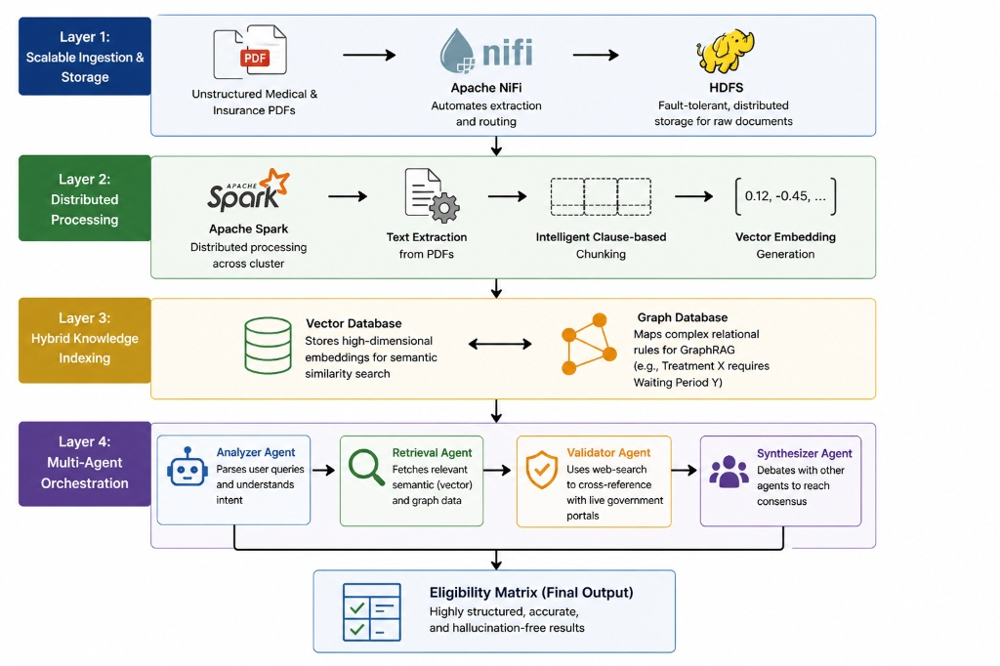

# 🏛️ Multi‑Agent GraphRAG System for Indian Government Insurance

**Project Context:** RV College of Engineering (RVCE) — Big Data Technology

## Overview
This repository implements a Big Data pipeline that ingests government insurance policies (PDFs), processes them with Spark and LLMs, and provides a hybrid retrieval system combining a vector store (Milvus) and a knowledge graph (Neo4j). The system is designed to reduce LLM hallucinations by cross-checking semantic retrievals with explicit graph rules and returning structured Eligibility Matrices.

## System Architecture


### The 5-Layer Big Data Stack:
1. **Automated Ingestion (Apache NiFi):** Securely captures raw policy PDFs from local environments and routes them into the distributed cluster without manual intervention.
2. **Distributed Storage (Hadoop HDFS):** Provides fault-tolerant, scalable persistence for all raw unstructured documents.
3. **Parallel Compute (Apache Spark):** Distributes the heavy NLP workloads. It handles recursive text chunking, PyTorch-based vector embedding generation (`all-MiniLM-L6-v2`), and orchestrates LLM-based triplet extraction.
4. **Hybrid Semantic Memory:** * **Milvus (Vector DB):** Stores 384-dimensional embeddings for high-speed semantic similarity searches.
   * **Neo4j (Graph DB):** Stores extracted Entities and Relationships (e.g., `[PMFBY] -> COVERS -> [FARMERS]`) to map complex policy rules.
5. **Cognitive Orchestration (LangGraph + Cohere):** A swarm of specialized AI agents (Vector Retriever, Graph Retriever, and Synthesizer) that fuse the data and utilize the `command-r-08-2024` model to output structured BI dashboards (Eligibility Matrices).

## Prerequisites
- Docker Desktop (recommended: allocate ≥ 8 GB RAM)
- Python 3.10+
- Java 8 (required by PySpark/Hadoop)
- A Cohere API key (https://dashboard.cohere.com)

## Quickstart (Windows - Powershell)
Follow these steps to get a local environment running.

### 1) Clone and prepare the Python environment
```powershell
git clone https://github.com/NiranjanKaithota/insurance-rag-bdt.git
cd insurance-rag-system
python -m venv venv
.\venv\Scripts\Activate.ps1   # in PowerShell
pip install -r requirements.txt
```

Create a `.env` file in the project root with your Cohere key:
```
COHERE_API_KEY=your_api_key_here
```

### 2) Start infrastructure (Docker Compose)
Spin up Hadoop, NiFi, Milvus, Neo4j and other services:

```powershell
docker-compose up -d
# Wait ~60-90s for services (NiFi, HDFS etc.) to initialize fully
```

### 3) Ingest PDFs (automated)
- Place PDFs into `data/input_pdfs/`.
- Open NiFi UI: https://localhost:8443/nifi (default: `admin` / `SuperSecretPassword123!`)
- Ensure the `GetFile -> PutHDFS` flow is running. Files placed in `data/input_pdfs/` will be routed into HDFS, typically under `/data/raw/insurance_pdfs/`.

### 4) Build the AI "brain" (processing & indexing)
Run the Spark-based pipelines once files are in HDFS.

- Build the vector database (Milvus):
```powershell
python spark_processing/process_policies.py
```

- Build the knowledge graph (Neo4j):
```powershell
python spark_processing/build_graph.py
```

You can inspect the Neo4j DB at http://localhost:7474 (default: `neo4j` / `insurance_graph_password`). Example query to preview nodes:
```cypher
MATCH (n) RETURN n LIMIT 100;
```

### 5) Run the multi-agent RAG orchestrator
```powershell
python multi_agent_rag.py
```

Example user question: "What schemes are intended for farmers or agriculture?"

Sample output (structured table):
| Scheme Name | Target Beneficiary | Key Benefits / Coverage | Prerequisites |
| --- | --- | --- | --- |
| Pradhan Mantri Fasal Bima Yojana (PMFBY) | All farmers (including sharecroppers & tenant farmers) | Comprehensive crop insurance from pre-sowing to post-harvest | Voluntary enrollment |

## Notes & Tips
- Spark in the included scripts is configured to use `local[2]` to limit local CPU/RAM use; adjust if you have more resources.
- If you modify Docker compose or change service ports, update the README and any scripts that reference those endpoints.

## Built With
- Apache Hadoop, Spark, NiFi
- Milvus (vector DB)
- Neo4j (graph DB)
- LangGraph & LangChain (agent orchestration)
- Cohere (LLM inference)
- PyTorch & sentence-transformers (local embedding generation)

## Troubleshooting
- If NiFi doesn't pick files: confirm the `GetFile` processor points to `data/input_pdfs/` and is running.
- If Spark jobs fail: check Java version and that required ports for HDFS are open and Docker containers are healthy.